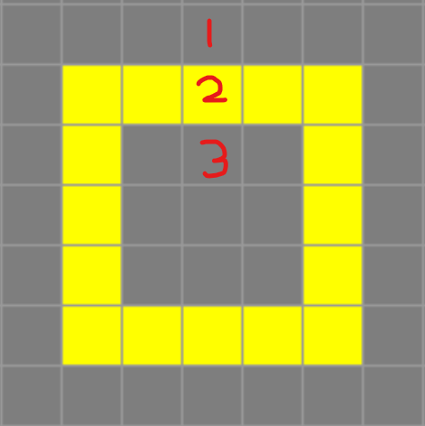

## Prep Activity

First, review the definition of a directional derivative [given in LibreTexts Calculus 3e](https://math.libretexts.org/Bookshelves/Calculus/Calculus_3e_(Apex)/12%3A_Functions_of_Several_Variables/12.06%3A_Directional_Derivatives). Think about how you would approximate this equation for a potential in 3-space $V(\vec{r})$ in a direction $\hat{n}$.

Consider a 2D rectangle at a constant potential $\sigma_0$ in empty space on a grid of size $h$.

Given the potentials $V_{ab}$ at point 1, and $V_{be}$ at point 3, find the potential $V_{int}$ at point 2 satisfying the surface charge boundary condition
$
    \frac{\partial V_{ab}}{\partial \hat{n}} - \frac{\partial V_{be}}{\partial \hat{n}} = -\frac{\sigma_0}{\epsilon_0}.
$

## Solution
$
    \frac{\partial V(\vec{r})}{\partial \hat{n}} \approx \frac{V(\vec{r} + h\hat{n}) - V(\vec{r})}{h}.
$

In the given example, $\hat{n} = \hat{y}$, so we have
$
    \frac{V_{ab}-V_{int}}{h}-\frac{V_{int}-V_{be}}{h}=-\frac{\sigma_0}{\epsilon_0}
$
So
$
    V_{int} = \frac{V_{ab}+V_{be}}{2} + \frac{h}{2} \frac{\sigma_0}{\epsilon_0}.
$